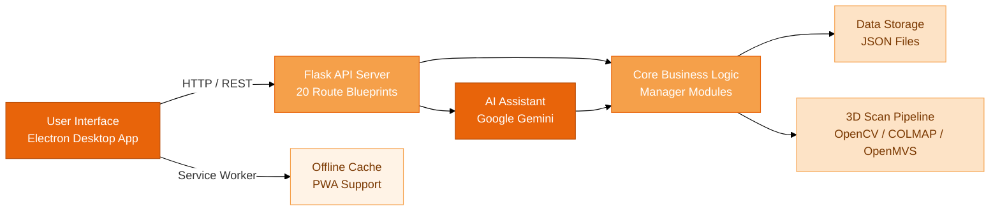

# Discovereye

A desktop application for discovering, reviewing, and supporting local, independently owned businesses across Canadian cities. Built as an Electron app backed by a Python Flask API with file-based JSON storage.

---

## Table of Contents

1. [Overview](#overview)
2. [Features](#features)
3. [Architecture](#architecture)
4. [Tech Stack](#tech-stack)
5. [Getting Started](#getting-started)
6. [Environment Variables](#environment-variables)
7. [Running the Application](#running-the-application)
8. [Project Structure](#project-structure)
9. [API Reference](#api-reference)
10. [Data Storage](#data-storage)
11. [Team](#team)
12. [License](#license)

---

## Overview

Discovereye helps users find local, non-chain businesses in their area. The business catalog is populated from the OpenStreetMap Overpass API and spans approximately 550,000 lines of structured data across eight Canadian cities. Users can search, filter by category or geolocation radius, read and write reviews, save favorites into collections, track deals, make reservations, and interact with an AI-powered chat agent for personalized recommendations.

Business owners can verify their accounts to unlock management capabilities: creating deals, uploading 3D scans of their storefronts, publishing blog posts, and managing reservations.

---

## Features

### Business Discovery
- Full-text fuzzy search powered by fuzzywuzzy and python-Levenshtein
- Category-based filtering (food, retail, services, and more)
- Geolocation radius filtering using the Haversine formula
- Interactive map view with business markers via Leaflet.js
- Trending businesses ranked by a logarithmic points formula derived from uploaded receipts

### Reviews and Ratings
- Submit reviews with text, star ratings (1--5), and optional photo uploads
- Business owners can reply to reviews
- Reviews are validated through Pydantic schemas

### Social Features
- Friend requests: send, accept, reject
- In-app notification system for friend activity and updates
- User search by username or email

### Deals and Coupons
- Browse deals created by verified business owners
- Deal types: percentage off, fixed discount, buy-one-get-one
- Optional web scraping of external deals via DuckDuckGo Search

### Saved Items and Collections
- Save individual businesses or deals
- Organize saved businesses into named collections

### Reservations
- Create, view, and manage reservations at businesses

### Calendar Integration
- Google Calendar OAuth for syncing reservations and events
- Server-side token storage for persistent access across sessions

### AI Agent
- Conversational AI assistant powered by Google Gemini with function calling
- Can search businesses, look up deals, check reservations, and answer questions on behalf of the user
- Multi-conversation support with server-side state management (1-hour TTL per conversation)
- Suggestion chips for quick prompts

### AI-Powered Recommendations
- Personalized business suggestions using Google Gemini Flash
- Draws on user activity: receipts, saves, reviews, and friend interactions
- Results cached for 6 hours to reduce API calls

### 3D Storefront Scans
- Upload video scans of business interiors
- Async processing pipeline: frame extraction (OpenCV), Structure-from-Motion (COLMAP), dense reconstruction (OpenMVS), mesh generation, and GLB export (trimesh)
- Resulting 3D models served to the frontend for in-browser viewing

### Blog Posts
- Business owners can create and publish blog posts
- Read-only blog feed for all users

### Business Owner Verification
- Users can apply to upgrade their account to a business owner role
- Verification form collects business name, address, phone, and category
- On approval, a new business entry is created and the user gains access to business management controls (deal creation, media uploads, blog posts)

### Security
- Password hashing with bcrypt
- Google reCAPTCHA v3 for bot prevention (optional, configurable)
- Rate limiting via Flask-Limiter
- Session management with configurable expiry (default: 7 days)

### Progressive Web App
- Service worker with network-first caching strategy for code assets
- Offline fallback from cache for static resources

### Theming and Accessibility
- Light and dark theme support via CSS custom properties
- Responsive layout with mobile-optimized hamburger navigation
- Grouped navbar with dropdown categories (Explore, Activity, Social)

---

## Architecture



- **Frontend (Electron):** Chromium-based desktop shell. The main process (`frontend/main.js`) spawns Flask as a child process, waits for it to become healthy, then loads the UI. All frontend code is vanilla HTML, CSS, and JavaScript using ES modules -- no build step or framework.
- **Backend (Flask):** 20 route blueprints registered on a single Flask application. Each blueprint maps to a core manager module that contains the domain logic. All data access goes through a shared `json_handler.py` utility.
- **Data Layer:** Flat JSON files in the `data/` directory. Binary uploads (images, 3D models, receipt photos) are stored under `data/uploads/` subdirectories.

The frontend communicates with the backend at `http://127.0.0.1:5001`. Session state is maintained via localStorage on the client side; the server tracks sessions in `data/sessions.json`.

---

## Tech Stack

| Layer | Technologies |
|---|---|
| Backend | Python, Flask, Flask-CORS, Flask-Limiter |
| Data Validation | Pydantic, pydantic-extra-types, phonenumbers |
| AI / LLM | Google Gemini (google-genai) |
| Search | fuzzywuzzy, python-Levenshtein |
| Authentication | bcrypt, reCAPTCHA v3 |
| Google APIs | google-auth, google-auth-oauthlib, google-api-python-client |
| 3D Processing | OpenCV, Pillow, trimesh (+ COLMAP, OpenMVS) |
| Web Scraping | requests, ddgs (DuckDuckGo Search) |
| Math / Science | numpy |
| Frontend | Electron 33+, vanilla HTML/CSS/JS (ES modules) |
| Maps | Leaflet.js (CDN) |
| Testing | pytest, pytest-cov |
| Linting | Ruff |

---

## Getting Started

### Prerequisites

- Python 3.10 or later
- Node.js 18 or later (for Electron)
- Git

### Installation

1. Clone the repository:
   ```bash
   git clone https://github.com/Albertlungu/CNLC.git
   cd Discovereye
   ```

2. Set up the Python virtual environment and install dependencies:

   macOS / Linux:
   ```bash
   ./setup.sh
   ```

   Windows:
   ```powershell
   .\setup.ps1
   ```

   Or manually:
   ```bash
   python -m venv venv
   source venv/bin/activate   # On Windows: venv\Scripts\activate
   pip install -r requirements.txt
   ```

3. Install Electron dependencies:
   ```bash
   cd frontend
   npm install
   cd ..
   ```

---

## Environment Variables

Copy the example environment file and fill in your credentials:

```bash
cp .env.example .env
```

The following variables are supported:

| Variable | Required | Description |
|---|---|---|
| `GOOGLE_CALENDAR_CLIENT_ID` | For calendar features | OAuth client ID from Google Cloud Console |
| `GOOGLE_CALENDAR_CLIENT_SECRET` | For calendar features | OAuth client secret |
| `GOOGLE_CALENDAR_REDIRECT_URI` | For calendar features | Must match the authorized redirect URI in your Google project (default: `http://127.0.0.1:5001/api/calendar/callback`) |
| `RECAPTCHA_SECRET_KEY` | Optional | Google reCAPTCHA v3 secret key for bot prevention |

Environment variables are loaded automatically by `python-dotenv` when the server starts.

---

## Running the Application

### Option 1: Electron (production-like)

```bash
source venv/bin/activate
cd frontend
npm start
```

This launches Electron, which automatically starts the Flask backend as a child process and opens the application window once the server is healthy.

### Option 2: Flask only (development)

```bash
source venv/bin/activate
python run_server.py
```

The API server starts at `http://127.0.0.1:5001`. Open any of the HTML pages in `frontend/src/` directly in a browser pointed at that address (e.g., `http://127.0.0.1:5001/businesses.html`).

### Stopping

If you started the server via `start.sh`, use:
```bash
./stop.sh
```

---

## Project Structure

```
Discovereye/
|-- backend/                            Python backend
|   |-- api/
|   |   |-- server.py                   Flask application entry point, blueprint registration
|   |   |-- routes/                     20 route blueprints
|   |       |-- agent.py                AI agent conversation endpoints
|   |       |-- auth.py                 Login, registration, profile update
|   |       |-- blogs.py                Blog CRUD
|   |       |-- bookmarks.py            Bookmark management
|   |       |-- businesses.py           Business search, filter, CRUD
|   |       |-- calendar.py             Google Calendar OAuth and event sync
|   |       |-- deals.py                Deal creation and retrieval
|   |       |-- friends.py              Friend requests and social graph
|   |       |-- media.py                3D model and video upload
|   |       |-- notifications.py        Notification delivery and read status
|   |       |-- recommendations.py      AI-powered recommendation endpoint
|   |       |-- reservations.py         Reservation management
|   |       |-- reviews.py              Review submission and retrieval
|   |       |-- saved.py                Saved businesses and collections
|   |       |-- scans.py                3D scan upload and processing
|   |       |-- sessions.py             Session validation
|   |       |-- trending.py             Trending score calculation
|   |       |-- users.py                User profile and business upgrade
|   |       |-- verification.py         reCAPTCHA verification
|   |-- core/                           Domain logic (17 manager modules)
|   |   |-- agent_manager.py            Gemini function-calling agent
|   |   |-- ai_manager.py              Gemini Flash recommendation engine
|   |   |-- blog_manager.py            Blog post operations
|   |   |-- bookmark_manager.py        Bookmark operations
|   |   |-- business_manager.py        Business search, fuzzy match, geo filter
|   |   |-- calendar_manager.py        Google Calendar OAuth token management
|   |   |-- deal_manager.py            Deal CRUD and web scraping
|   |   |-- friend_manager.py          Friend request lifecycle
|   |   |-- media_manager.py           Media upload handling (50 MB limit)
|   |   |-- notification_manager.py    Notification CRUD
|   |   |-- reservation_manager.py     Reservation lifecycle
|   |   |-- review_manager.py          Review CRUD with photo support
|   |   |-- saved_manager.py           Saved items and collections
|   |   |-- scan_processor.py          Async 3D reconstruction pipeline
|   |   |-- trending_manager.py        Receipt processing and trending score
|   |   |-- user_manager.py            User account CRUD and authentication
|   |   |-- verification.py            reCAPTCHA score verification
|   |-- models/                         Pydantic data models
|   |   |-- business.py                Business schema
|   |   |-- category.py                Category enumeration
|   |   |-- deal.py                    Deal schema
|   |   |-- friend.py                  Friend/friend request schema
|   |   |-- receipt.py                 Receipt schema
|   |   |-- reservation.py            Reservation schema
|   |   |-- review.py                  Review schema
|   |   |-- saved.py                   Saved item schema
|   |   |-- user.py                    User schema
|   |-- storage/                        Data persistence utilities
|   |   |-- json_handler.py            Generic JSON file read/write
|   |   |-- data_validator.py          Pre-save data validation
|   |-- utils/                          Shared helpers
|   |   |-- geo.py                     Haversine distance calculation
|   |   |-- password.py               bcrypt hashing utilities
|   |   |-- search.py                  Search and filter helpers
|   |   |-- session.py                 Session management
|   |   |-- sorting.py                Multi-field sorting
|   |-- ml/                            Machine learning (placeholder)
|       |-- recommender.py            Future ML-based recommender
|
|-- frontend/                           Electron desktop application
|   |-- main.js                         Electron main process (spawns Flask)
|   |-- preload.js                      Secure context bridge
|   |-- package.json                    Node.js / Electron dependencies
|   |-- src/                            Frontend source code
|       |-- index.html                  Landing page
|       |-- auth.html                   Login and registration
|       |-- businesses.html             Business directory
|       |-- business-detail.html        Single business view
|       |-- map.html                    Leaflet.js interactive map
|       |-- deals.html                  Deals browser
|       |-- friends.html                Friend management
|       |-- blogs.html                  Blog feed
|       |-- calendar.html               Google Calendar UI
|       |-- reservations.html           Reservation management
|       |-- saved.html                  Saved businesses and collections
|       |-- trending.html               Trending businesses
|       |-- profile.html                User profile and settings
|       |-- agent.html                  AI chat agent
|       |-- manifest.json               PWA manifest
|       |-- sw.js                       Service worker
|       |-- css/                        24 stylesheet files
|       |-- js/                         23 JavaScript modules (ES modules)
|       |   |-- api-client.js           Centralized API communication layer
|       |   |-- components/             Shared UI components (navbar, etc.)
|       |   |-- utils/                  Frontend utility functions
|       |-- assets/
|           |-- icons/                  Application icons
|           |-- images/                 Static images
|           |-- models/                 3D model assets
|
|-- data/                               JSON file storage
|   |-- businesses.json                 Business catalog (~550k lines)
|   |-- users.json                      User accounts
|   |-- reviews.json                    Reviews
|   |-- deals.json                      Deals and coupons
|   |-- friends.json                    Friend relationships
|   |-- friend_requests.json            Pending friend requests
|   |-- reservations.json               Reservations
|   |-- blogs.json                      Blog posts
|   |-- collections.json                Saved collections
|   |-- saved_businesses.json           Saved business references
|   |-- saved_deals.json                Saved deal references
|   |-- receipts.json                   Uploaded receipts
|   |-- trending_points.json            Trending scores
|   |-- notifications.json              In-app notifications
|   |-- media.json                      Media metadata
|   |-- scans.json                      3D scan metadata
|   |-- sessions.json                   Active sessions
|   |-- calendar_tokens.json            Google Calendar OAuth tokens
|   |-- calendar_oauth_states.json      OAuth state parameters
|   |-- recommendations_cache.json      Cached AI recommendations
|   |-- uploads/                        Binary file storage
|       |-- receipts/                   Receipt photo uploads
|       |-- reviews/                    Review photo uploads
|
|-- config/
|   |-- config.py                       Centralized path and setting constants
|   |-- settings.json                   Runtime settings (reserved)
|
|-- scripts/                            Data population utilities
|   |-- populate_businesses.py          Fetch businesses from Overpass API
|   |-- overpass_api.py                 OpenStreetMap Overpass API client
|   |-- populate_images.py             Fetch business images
|
|-- tests/
|   |-- test_backend/                   Backend test scripts
|   |-- JSON/                           Test fixture data
|
|-- for_teammates/                      Internal documentation
|   |-- API.md                          API endpoint reference
|   |-- full_project_plan.md            Project plan and feature specs
|   |-- commiting_prefixes.md           Git commit message conventions
|   |-- reCAPTCHA.md                    reCAPTCHA setup guide
|
|-- .env.example                        Environment variable template
|-- requirements.txt                    Python dependencies
|-- pyproject.toml                      Ruff linter configuration
|-- run_server.py                       Flask server launcher (with dotenv)
|-- setup.sh                            macOS/Linux setup script
|-- setup.ps1                           Windows setup script
|-- start.sh                            Start server in background
|-- stop.sh                             Stop background server
|-- SOURCES.md                          Third-party license attribution
|-- COLLABORATING.md                    Collaboration guidelines
|-- LICENSE                             MIT License
|-- README.md                           This file
```

---

## API Reference

All endpoints are prefixed with `/api`. See [for_teammates/API.md](for_teammates/API.md) for the full endpoint reference.

Key endpoint groups:

| Prefix | Description |
|---|---|
| `/api/auth` | Registration, login, logout, profile retrieval and update |
| `/api/businesses` | Search, filter, get by ID, create, update, delete |
| `/api/reviews` | Submit, retrieve, reply to reviews |
| `/api/deals` | Create, list, delete deals; scrape external deals |
| `/api/friends` | Send/accept/reject friend requests, list friends |
| `/api/saved` | Save/unsave businesses and deals, manage collections |
| `/api/reservations` | Create, list, cancel reservations |
| `/api/calendar` | Google Calendar OAuth flow and event sync |
| `/api/agent` | AI agent chat (send message, list conversations) |
| `/api/recommendations` | AI-powered personalized business suggestions |
| `/api/trending` | Trending scores and receipt uploads |
| `/api/blogs` | Blog post CRUD |
| `/api/media` | 3D model and video uploads |
| `/api/scans` | 3D scan upload and processing status |
| `/api/notifications` | Retrieve and mark notifications as read |
| `/api/users` | Business owner upgrade |
| `/api/verification` | reCAPTCHA token verification |

---

## Data Storage

Discovereye uses flat JSON files rather than a database. This keeps the project portable and eliminates external service dependencies. All data files live in the `data/` directory and are read/written through a centralized `json_handler.py` utility.

The business catalog is sourced from the OpenStreetMap Overpass API via the scripts in `scripts/`. The population script queries for non-chain businesses in eight Canadian cities and outputs structured JSON conforming to the Pydantic `Business` model.

Binary uploads (receipt images, review photos, 3D models) are stored on disk under `data/uploads/` with metadata references in the corresponding JSON files.

---

## Team

| Role | Name |
|---|---|
| Backend | Albert Lungu |
| Frontend | Vivian Wang, Eason Yang |

---

## License

This project is licensed under the MIT License. See [LICENSE](LICENSE) for details.

Copyright (c) 2026 Vivian Wang, Eason Yang, Albert Lungu